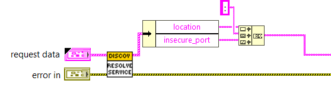
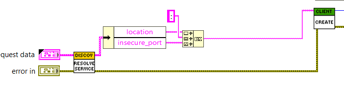
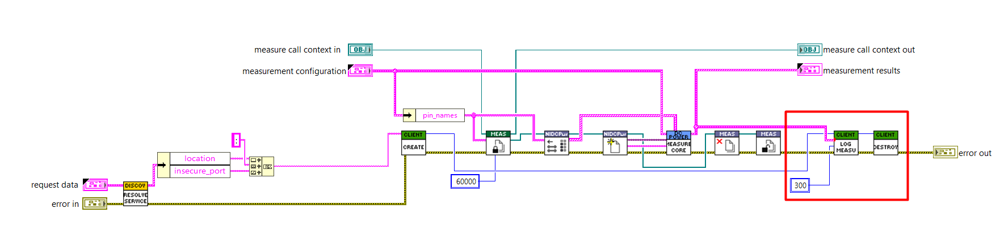

# Custom Measurement Plugin Services

This README provides a step-by-step guide to create a custom service. The process involves creating
a proto file, generating stubs, establishing a connection, and using the custom service in
different measurements.

## Step 1: Create a Proto File

Create a `.proto` file that defines the service and messages.

```proto
syntax = "proto3";

package custom_measurement;

service CustomService {
    rpc PerformAction (ActionRequest) returns (ActionResponse);
}

message ActionRequest {
    string action = 1;
    string parameters = 2;
}

message ActionResponse {
    bool success = 1;
    string result = 2;
}
```

## Step 2: Generate Stubs

Use the protobuf compiler to generate the gRPC code from the proto file.

```sh
protoc --python_out=. --grpc_python_out=. <proto_file>
```

## Step 3: Implement the Custom Service

Create a server implementation for the service.

### Implementing a simple Custom Service and log data in a csv file

- Initialize a gRPC server.
- Register the service implementation with the gRPC server. This allows the server to
  handle incoming requests.
- Configure and start a gRPC server to listen for incoming connections on a port, and then keep the
  server running indefinitely to handle incoming requests.
- Open the CSV File in a preferred Mode.
- Write the action, parameters, and result to the CSV file.

```python
import grpc
from concurrent import futures
import custom_measurement_pb2
import custom_measurement_pb2_grpc

class CustomService(custom_measurement_pb2_grpc.CustomServiceServicer):
    def PerformAction(self, request, context):
        print(f"Received action: {request.action} with parameters: {request.parameters}")
        # Implement your custom logic here
        with open(csv_file_path, mode='a', newline='') as file:
            writer = csv.writer(file)
            writer.writerow([request])

        return LogMeasurementResponse()

def serve():
    server = grpc.server(futures.ThreadPoolExecutor(max_workers=10))
    custom_measurement_pb2_grpc.add_CustomServiceServicer_to_server(CustomService(), server)
    server.add_insecure_port('[::]:50051')
    server.start()
    server.wait_for_termination()

if __name__ == '__main__':
    serve()
```

### Implementing a Custom Service with BDC Logger and log data in a csv file

- Initialize a gRPC server.
- Register the service implementation with the gRPC server. This allows the server to
  handle incoming requests.
- Configure and start a gRPC server to listen for incoming connections on a port, and then keep the
  server running indefinitely to handle incoming requests.
- Install the `whl` file for BDC Logger. This installs all the dependencies of the bdc logger.

```sh
pip install .\bdcdatalogger-22.8.0-py3-none-any.whl
```

- Import necessary modules.
- Create a metadata dictionary to store relevant information about the program or test.
- Create an instance of TestRun with the metadata, folder path, and file name where the logs will be
  stored.
- Use the Metadata object from the TestRun instance to add numeric and string parameters, as well as
  additional information.
- Iterate over the measured pins and log the voltage measurements along with additional information
  like current, compliance status, and timestamp.
- Remove all metadata, parameters, and additional information from the Metadata object to clean up
  after logging.

```python
import grpc
from concurrent import futures
import custom_measurement_pb2
import custom_measurement_pb2_grpc
from bdcdatalogger import Channel, Fields, MeasurementDetails, Series, TestRun, Waveform

class MeasurementService(LogMeasurementServicer):
    def LogMeasurement(self, request, context):
        # Step 1: Define Metadata
        METADATA = {
            Fields.ProgramName: "Your Program Name",
        }

        # Step 2: Initialize TestRun
        run = TestRun(
            metadata=METADATA, 
            folder_path=os.path.join(os.getcwd(), "log_folder"), 
            file_name="log_file"
        )
        data = run.Metadata()

        # Step 3: Add Metadata and Parameters
        for pin_index, pin in enumerate(request.measured_pins):
            data.add_string_parameter("Pin", pin)
            
            measurement = MeasurementDetails(
                name="MeasurementName",
                spec_id="SpecID",
                value=request.measurement_values[pin_index],
                unit="Unit",
            )
            
            data.add_additional_info("Current", str(request.current[pin_index]) + "A")
            data.add_additional_info("Logged Time", str(datetime.now().strftime("%Y-%m-%d:%H:%M:%S")))
            
            # Step 4: Log Measurements
            run.log_measurement(measurement)
        
        # Step 5: Clean Up
        data.remove_all_metadata()
        data.remove_all_parameters()
        data.remove_all_additional_info()

        run.close_datalog()
        print(f"Received measurement: {request}")

def serve():
    server = grpc.server(futures.ThreadPoolExecutor(max_workers=10))
    custom_measurement_pb2_grpc.add_CustomServiceServicer_to_server(CustomService(), server)
    server.add_insecure_port('[::]:50051')
    server.start()
    server.wait_for_termination()

if __name__ == '__main__':
    serve()
```

## Step 4: Establish Connection

Create a client to connect to the server and perform actions.

- Create a gRPC client that connects to a server running on a localhost.
- This creates a stub for the custom service.

```python
import grpc
import custom_measurement_pb2
import custom_measurement_pb2_grpc

def run():
        with grpc.insecure_channel('localhost:50051') as channel:
                stub = custom_measurement_pb2_grpc.DataLoggingServiceStub(channel)
                response = stub.LogData(custom_measurement_pb2.LogRequest(data='Sample data'))
                print(f"Log success: {response.success}")

if __name__ == '__main__':
        run()
```

## Using the Custom Service in Python

Here is an example of how to integrate a custom logging service in Python.

- Define Service Interface and Class Names:
  - Set the gRPC service interface and class names.

```python
GRPC_SERVICE_INTERFACE_NAME = "ni.measurementlink.logger.v1.LogService"
GRPC_SERVICE_CLASS = "ni.measurementlink.logger.v1.LogService"
```

- Create a Discovery Client:
  - Instantiate a DiscoveryClient to resolve the service location.

```python
discovery_client = DiscoveryClient()
```

- Resolve the Service Location:
  - Use the discovery client to resolve the service location based on the provided interface and
    service class.

```python
service_location = discovery_client.resolve_service(
    provided_interface=GRPC_SERVICE_INTERFACE_NAME,
    service_class=GRPC_SERVICE_CLASS
)
```

- Create a gRPC Channel:
  - Create an insecure gRPC channel to the resolved service location.

```python
channel = grpc.insecure_channel(service_location.insecure_address)
```

- Create a Stub for the Custom Service:
  - Create a stub for the CustomService using the gRPC channel.

```python
stub = stubs.log_measurement_pb2_grpc.LogMeasurementStub(channel=channel)
```

- Prepare the Data for the Action:

```python
voltage = [measurement.voltage for measurement in measurements]
current = [measurement.current for measurement in measurements]
in_compliance = [measurement.in_compliance for measurement in measurements]
```

- Call the APIs:

```python
stub.LogMeasurement(LogMeasurementRequest(
    measured_sites=measured_sites,
    measured_pins=measured_pins,
    voltage=voltage,
    current=current,
    in_compliance=in_compliance,
))
```

## Using the Custom Service in LabVIEW

Here is an example of how to integrate a custom logging service in LabVIEW.

- Define Service Interface and Class Names:
  - Provide the gRPC service interface and class names as inputs to the Resolve Service API to
    retrieve the port where the custom service is running.



- Create a Discovery Client:
  - Instantiate a DiscoveryClient to resolve the service location.



- The client calls the Service API by obtaining the request models from the measurement service, and
  the data is logged to a file at the end using the logger service.



## Conclusion

This guide covered creating a proto file, generating stubs, implementing the service, establishing a
connection, and using the custom service in different measurements.
