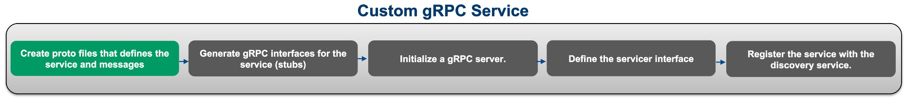
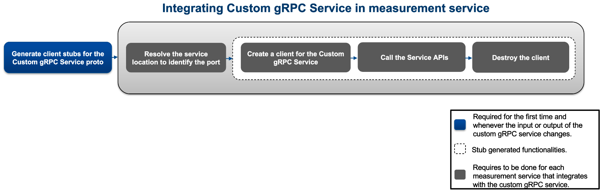

# Measurement Plug-In Service Extension Example

- [Measurement Plug-In Service Extension Example](#measurement-plug-in-service-extension-example)
  - [Custom Services in Measurement Plug-In framework](#custom-services-in-measurement-plug-in-framework)
  - [User Workflow](#user-workflow)
  - [Required Software](#required-software)
  - [Steps to create a user-defined service](#steps-to-create-a-user-defined-service)
    - [Note](#note)
  - [Steps to interact with the user-defined service by creating a client module in Python measurements](#steps-to-interact-with-the-user-defined-service-by-creating-a-client-module-in-python-measurements)
  - [Steps to interact with the user-defined service by creating client modules in LabVIEW measurements](#steps-to-interact-with-the-user-defined-service-by-creating-client-modules-in-labview-measurements)

## Custom Services in Measurement Plug-In framework

The Measurement Plug-In architecture is based on microservices, with components functioning as gRPC services. Since gRPC is network-based, it allows these components to be language-agnostic and work seamlessly across different programming environments. Any feature extensions or customizations, therefore, should also be implemented as gRPC services.

A user-defined gRPC service is a custom-built service where you define the service methods and message types in a `.proto` file, generate client and server code, and implement the server logic. Registering this service with the NI Discovery Service allows various clients to access and communicate with it over gRPC, making it easy to integrate across technology stacks.

Data loggers are often used to record measurements and debug data during execution. For example, a logger implemented in Python might only be compatible with Python-based systems. However, if other measurement plug-ins are written in languages like LabVIEW or C#, direct integration may not be possible. By converting the logger into a gRPC service and registering it with the NI Discovery Service, it becomes accessible to all measurement plug-ins, regardless of language.

## User Workflow

## Required Software

- [InstrumentStudio 2024 Q3](https://www.ni.com/en/support/downloads/software-products/download.instrumentstudio.html#544066) or later
- Recommended: [TestStand 2021 SP1](https://www.ni.com/en/support/downloads/software-products/download.teststand.html#445937) or later
- [Python 3.9](https://www.python.org/downloads/release/python-390/) or later
- [LabVIEW](https://www.ni.com/en/support/downloads/software-products/download.labview.html?srsltid=AfmBOoodoeCBIDbhGX4sSEVZ6WA_YbIXSdsnfHMejqtoGME3nEGfvxKg#544096) or later

Software dependencies,

- [LabVIEW Measurement Plug-ins](./examples/labview_measurement/README.md)
- [Python Measurement Plug-ins](./examples/python_measurement/README.md).

## Steps to create a user-defined service

Now, let's go through a step-by-step guide for creating a user-defined gRPC service in Python.

- Follow the steps outlined
  [here](https://grpc.io/docs/languages/python/basics/#defining-the-service) to define a proto
  file, create client and server code, and implement the gRPC server.
  - [Initialization of the gRPC server example - repo](https://github.com/ni/custom-measurement-plugin-services/blob/d9c7657c0f48d6cb733a1fe422e5491815cc51c1/src/json_logger/logger_service.py#L52-L70).
- Using the NI Discovery client, register the service to the NI Discovery service with its location
  information. This enables the user-defined service to be fetched and used in the measurement
  plug-ins.
  - Example:
  [Logger service implementation](./src/json_logger/logger_service.py).

### Note

- Using the NI Discovery Service to dynamically resolve the service location is preferred over a
  static port number as the port number may result in a conflict and are less adaptable to
  changes in the network environment.
- Dynamic resolution of the services' port number allows services to be relocated or scaled across
  different machines without requiring changes to the client configuration, ensuring more robust and
  maintainable deployments.

The following **flow chart** outlines the steps required to create a user-defined service and
registering it with the NI Discovery service.

## Steps to interact with the user-defined service by creating a client module in Python measurements

- Generate the client stubs for the user-defined service.
- Refer to the [instructions](https://grpc.io/docs/languages/python/basics/#creating-a-stub) to
  create a stub.
- Create a client module to establish a connection with the user-defined service from the python measurements.
- Define Service Interface and Service Class Names inside the module.
- Create a class that abstracts the methods from the generated client stubs to interact with the service.
- Use a discovery client to resolve the service location.
- Establish a gRPC channel to the service and create a stub for making API calls.
- Define methods in the client class to call the service methods, constructing and sending requests
  as needed.
- Example:
  [Establish connection to custom logger service in python](./examples/python_measurement/logger_service_client.py).

## Steps to interact with the user-defined service by creating client modules in LabVIEW measurements

- Install gRPC and LabVIEW gRPC Server and Client tool packages.
  - Refer to this
    [link](https://github.com/ni/grpc-labview/blob/master/docs/QuickStart.md#labview-grpc)
    for installation instructions.

- Generate client interfaces from the .proto file to communicate with the service methods using
  the `gRPC Server-Client [2] - Code Generator`.
  
  

- Establish the connection to communicate with the service methods.
- Create client VIs under a common class to interact with the user-defined service from LabVIEW
  measurements.
- Develop a client VI to initially establish a connection between the service and the measurement.
  - Define Service Interface and Class Names:
    - Provide the gRPC service interface and class names as inputs to the Resolve Service API to
      retrieve the port where the user-defined service is running.
  - Create a Discovery Client:
    - Instantiate a DiscoveryClient to resolve the service location.

  Example:
  
  

- In addition to establishing the connection, create a VI to call the service APIs using the gRPC ID
  obtained from the output of the previous VI.
  - Use the client generated during the stub creation process to call the service APIs.
  - The client then calls the Service APIs by obtaining the request models from the measurement
    service.

  Example:
  
  

- Finally, Create a VI to ensure that the client is properly closed without any open connections and
  all associated resources are released for the client.

  Example:
  
  

The following **flow chart** details the steps necessary to integrate a user-defined service into the
measurement service.

