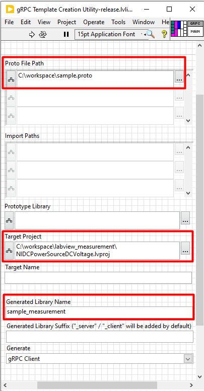

# Integrating Python User-defined Services with Measurement Plug-In

A user-defined gRPC service is a custom service created by a developer using the gRPC framework. It
involves defining service methods and message types in a .proto file, generating client and server
code from this definition, and implementing the server logic. This service can then be registered
with a discovery service to allow various clients to communicate with it over the gRPC protocol,
enabling integration across different technology stacks.

## Why User-Defined gRPC Service?

- In a manufacturing plant, various sensors and instruments are used to monitor and control the
production process. These sensors generate a large amount of measurement data that needs to be
logged. Currently, there is a logger implementation available in Python that can only be integrated
into Python measurement systems. However, the measurements are written in different technology
stacks, including LabVIEW and C#. As a result, the logger implementation written in one language
cannot be directly reused across all these different platforms.

- To address this issue, user-defined gRPC services can be registered with the discovery service. Once
registered, these services become available for various measurements to communicate through gRPC.
This approach allows for integration and implementation across different measurement systems without
the need to repeat the process for each technology stack.

## User Workflow

## Required Software

- [InstrumentStudio 2024 Q3](https://www.ni.com/en/support/downloads/software-products/download.instrumentstudio.html#544066)
  or later
- Recommended: [TestStand 2021 SP1](https://www.ni.com/en/support/downloads/software-products/download.teststand.html#445937)
  or later

Software dependencies,

- [LabVIEW Measurement Plug-ins](./measurements/labview_measurement/README.md)
- [Python Measurement Plug-ins](./measurements/python_measurement/README.md).

## Steps to create a user-defined service

Now, let's go through a step-by-step guide for creating a user-defined gRPC service in Python.

- Follow the steps outlined
  [here](https://grpc.io/docs/languages/python/basics/#defining-the-service) to define a proto
  file, create client and server code, and implement the gRPC server.
  - [Initialization of the gRPC server example - repo](https://github.com/ni/custom-measurement-plugin-services/blob/d9c7657c0f48d6cb733a1fe422e5491815cc51c1/src/json_logger/logger_service.py#L52-L70).
- Using the NI Discovery client, register the service to the NI Discovery service with its location
  information. This enables the user-defined service to be fetched and used in the measurement
  plug-ins.
  - Example:
  [Logger service implementation](./src/json_logger/logger_service.py).

### Note

- Using a discovery service to dynamically resolve the service location is advantageous over using a
  fixed port number because fixed port numbers can lead to conflicts and are less adaptable to
  changes in the network environment.
- Dynamic resolution allows services to be relocated or scaled across different machines without
  requiring changes to the client configuration, ensuring more robust and maintainable deployments.

The following **flow chart** outlines the steps required to create a user-defined service and
registering it with the NI Discovery service .

## Steps to interact with the user-defined service by creating a client module in Python measurements

- Generate the client stubs for the user-defined service.
- Refer to the [instructions](https://grpc.io/docs/languages/python/basics/#creating-a-stub) to
  create a stub.
- Create a client module to establish a connection with the user-defined service from the python measurements.
- Define Service Interface and Service Class Names inside the module.
- Create a class that abstracts the methods from the generated client stubs to interact with the service.
- Use a discovery client to resolve the service location.
- Establish a gRPC channel to the service and create a stub for making API calls.
- Define methods in the client class to call the service methods, constructing and sending requests
  as needed.
- Example:
  [Establish connection to custom logger service in python](./measurements/python_measurement/logger_service_client.py).

## Steps to interact with the user-defined service by creating client modules in LabVIEW measurements

- Install gRPC and LabVIEW gRPC Server and Client tool packages.
  - Refer to this
    [link](https://github.com/ni/grpc-labview/blob/master/docs/QuickStart.md#labview-grpc)
    for installation instructions.

- Generate client interfaces from the the .proto file to communicate with the service methods using
  the `gRPC Server-Client [2] - Code Generator`.

  

    
  

- Establish the connection to communicate with the service methods.
- Create client VIs under a common class to interact with the user-defined service from LabVIEW
  measurements.
- Develop a client VI to initially establish a connection between the service and the measurement.
  - Define Service Interface and Class Names:
    - Provide the gRPC service interface and class names as inputs to the Resolve Service API to
      retrieve the port where the user-defined service is running.
  - Create a Discovery Client:
    - Instantiate a DiscoveryClient to resolve the service location.

  Example:

  

    
  

- In addition to establishing the connection, create a VI to call the service APIs using the gRPC ID
  obtained from the output of the previous VI.
  - Use the client generated during the stub creation process to call the service APIs.
  - The client then calls the Service APIs by obtaining the request models from the measurement
    service.

  Example:
  
  

    
  

- Finally, Create a VI to ensure that the client is properly closed without any open connections and
  all associated resources are released for the client.

  Example:

  

    
  

The following **flow chart** details the steps necessary to integrate a user-defined service into the
measurement service.

