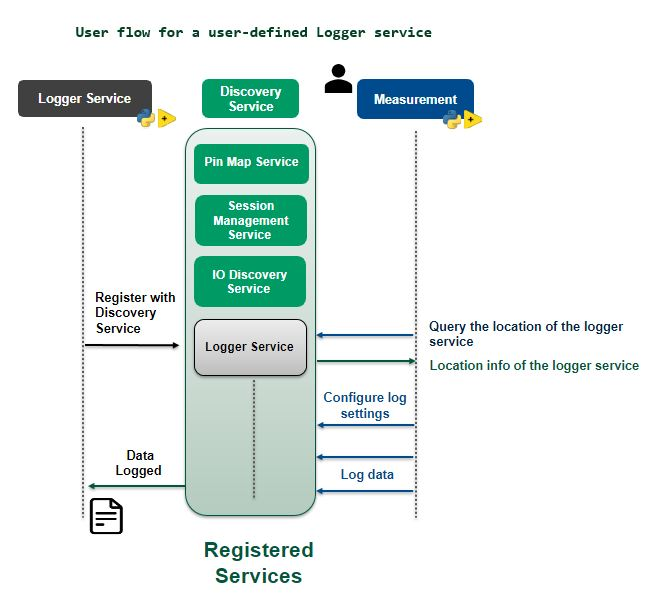

# Integrating User-defined Services with Measurement Plug-In

This README provides a step-by-step guide on how to integrate a user-defined service into a
measurement plug-in. The process involves defining a service, generating stubs, establishing a
connection to the user-defined service from the measurement services, and using those in
measurements.

## User Workflow

  

## Steps to create a user-defined service

- Follow the steps outlined
  [here](https://grpc.io/docs/languages/python/basics/#defining-the-service) to define a proto
  file, create client and server code, and implement the gRPC server.
  - [Initialization of the gRPC server example - repo](https://github.com/ni/custom-measurement-plugin-services/blob/d9c7657c0f48d6cb733a1fe422e5491815cc51c1/src/json_logger/logger_service.py#L52-L70).
- Using the NI Discovery client, register the service to the NI Discovery service with its location
  information. This enables the user-defined service to be fetched and used in the measurement
  plug-ins.
  - Example:
  [Logger service implementation](../src/json_logger/logger_service.py).

The following **flow chart** outlines the steps required to create a user-defined service and
registering it with the NI Discovery service .

## Steps to interact with the user-defined service in Python measurements

- Generate the client stubs for the service.
- Using the discovery client, get the location of the service and create a stub to communicate with
  the service.
- Call the service methods using the created stub.
- Refer to the [instructions](https://grpc.io/docs/languages/python/basics/#creating-a-stub) to
  create a stub.
- Example:
  [Establish connection to custom logger service in python](../measurements/python_measurement/logger_service_helper.py).

## Steps to interact with the user-defined Service in LabVIEW measurements

- Install gRPC and LabVIEW gRPC Server and Client tool packages.
  - Refer to this
    [link](https://github.com/ni/grpc-labview/blob/master/docs/QuickStart.md#labview-grpc)
    for installation instructions.

- Generate client interfaces from the the .proto file to communicate with the service methods using
  the `gRPC Server-Client [2] - Code Generator`.

  

    
  

- Establish the connection to communicate with the service methods.
  - Define Service Interface and Class Names:
    - Provide the gRPC service interface and class names as inputs to the Resolve Service API to
      retrieve the port where the user-defined service is running.
  - Create a Discovery Client:
    - Instantiate a DiscoveryClient to resolve the service location.

  

    
  

  - Use the client generated during the stub creation process to call the service APIs.
  - The client then calls the Service APIs by obtaining the request models from the measurement
    service.
    - Example:
  
  

    
  

The following **flow chart** details the steps necessary to integrate a user-defined service into the
measurement service.

## Note

The service classes and interfaces should be defined according to the user's preference for the
specific custom-defined service they want to interact with in the measurements.

## Conclusion

This guide should have provided you with the steps to implement a user-defined service and how it
can be used with measurement plug-ins in Python and LabVIEW.
