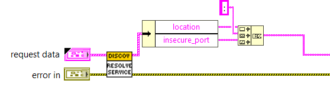
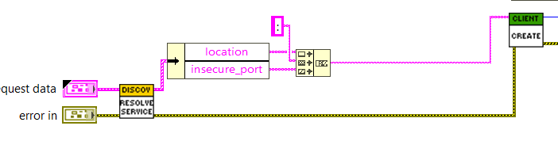

# Custom Measurement Plugin Services

This README provides a step-by-step guide to integrate custom services into a measurement plug-in.
The process involves defining a service, generating stubs, establishing a connection, and using
the custom services in various measurements.

## Steps

- Define the custom service and rpc methods under the service definition specifying the request and
  response types.
  - Example:
  [Logger service proto](../src/csv_logger/log_measurement.proto).
- Generate server interfaces from the service definition. Implement the servicer interface generated
  from the service definition, ensuring that the method implementation is complete.
- Set up a gRPC server to handle client requests and execute the service's tasks.
- Register the server location with the discovery service using the discovery client which ensures the
  custom services available to public.
  - Example:
  [Logger service implementation](../src/csv_logger/logger_service.py).
- Establish the connection to communicate with the service methods.
  - Create stubs to call the service methods.
  - Instantiate a discovery client to resolve the service location.
  - Create an insecure gRPC channel to the resolved service location.
  - Create a stub for the CustomService using the gRPC channel.
  - Call the service methods through the stubs.
  - Example:
  [Establish connection to custom logger service in python](../measurements/python_measurement/measurement.py).

## Integrating the the Custom Service in LabVIEW measurements

- Generate client interfaces from the the .proto file to communicate with the service methods using
  the `gRPC Server-Client [2] - Code Generator`.

  !["gRPC Server-Client [2] - Code Generator](gRPC_server_client_generator.JPG)

- Establish the connection to communicate with the service methods.
  - Define Service Interface and Class Names:
    - Provide the gRPC service interface and class names as inputs to the Resolve Service API to
      retrieve the port where the custom service is running.

    

  - Create a Discovery Client:
    - Instantiate a DiscoveryClient to resolve the service location.

    

  - The client calls the Service APIs by obtaining the request models from the measurement service.

## Conclusion

This guide covered steps to integrate the custom service in different measurements.
