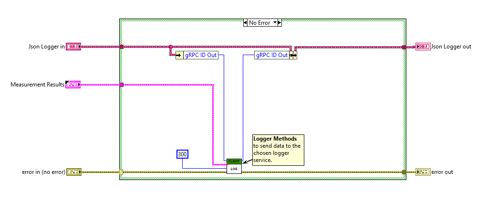

# User-defined Measurement Plugin Services

This README provides a step-by-step guide to integrate user-defined services into a measurement plug-in.
The process involves defining a service, generating stubs, establishing a connection, and using
the user-defined services in various measurements.

## Steps to create a user-defined service

- Follow the steps outlined in this
  [site](https://grpc.io/docs/languages/python/basics/#defining-the-service) to define a proto
  file, to create client and server code and to implement the gRPC server.
- Using the discovery client, register the service to the discovery service with its location
  information. This enables the user-defined service to be fetched and used in the measurement
  plug-ins.
  - Example:
  [Logger service implementation](../src/csv_logger/logger_service.py).

## Steps to interact with the user-defined service in Python measurements

- Generate the client stubs for the service.
- Using the discovery client, get the location of the service and create a stub to communicate with
  the service.
- Call the service methods using the created stub.
- Refer the instructions [link](https://grpc.io/docs/languages/python/basics/#creating-a-stub) to
  create a stub.
- Example:
  [Establish connection to custom logger service in python](../measurements/python_measurement/measurement.py).

## Steps to interact with the user-defined Service in LabVIEW measurements

- Install gRPC and LabVIEW gRPC Server and Client tool packages.
  - Refer to this
    [link](https://github.com/ni/grpc-labview/blob/master/docs/QuickStart.md#labview-grpc)
    for installation instructions.

- Generate client interfaces from the the .proto file to communicate with the service methods using
  the `gRPC Server-Client [2] - Code Generator`.

  !["gRPC Server-Client [2] - Code Generator](gRPC_Server_Client_Generator.png)

- Establish the connection to communicate with the service methods.
  - Define Service Interface and Class Names:
    - Provide the gRPC service interface and class names as inputs to the Resolve Service API to
      retrieve the port where the user-defined service is running.

    

  - Create a Discovery Client:
    - Instantiate a DiscoveryClient to resolve the service location.

    

  - Use and instantiate the client generated during the stub creation process to call the Service
    APIs.

  - The client then calls the Service APIs by obtaining the request models from the measurement
    service.
    - Example:
  
    

## Conclusion

This guide should have provided you with the steps to implement a user-defined service and how it
can be used with measurement plug-ins in Python and LabVIEW.
